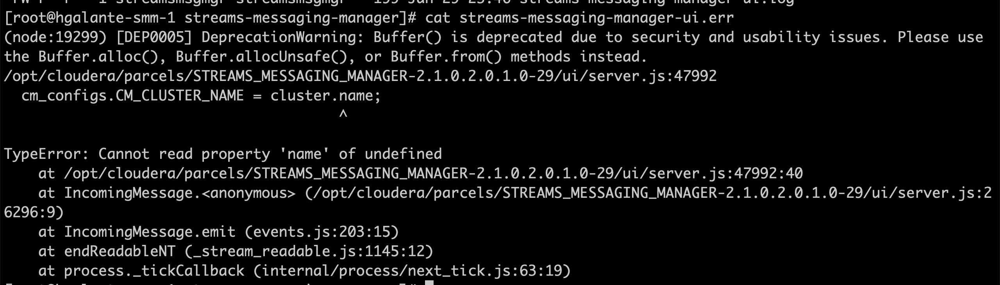
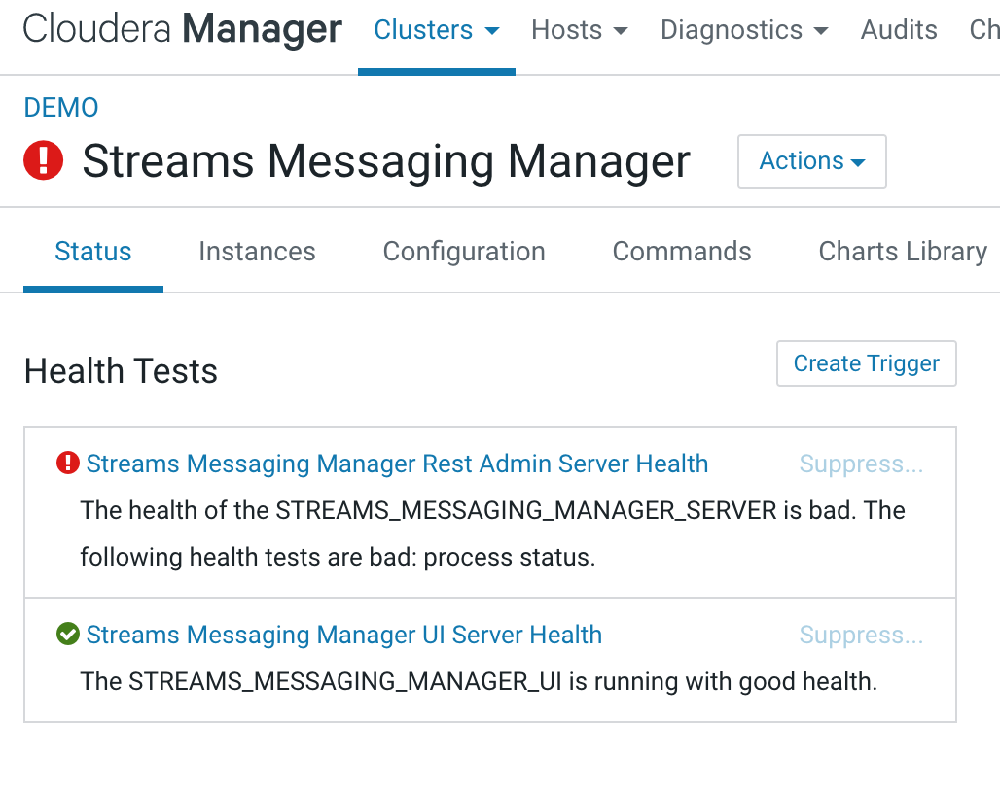

# Installing Cloudera Dataflow

In the setup_cdf.cfg you will find the trial versions of Cloudera Data Flow Stack.

## How to run it?

1) Copy the setup_cdf.sh and setup_cdf.cdf to the machine that will host Cloudera Manager
Sample:
    ```
     scp setup_cdf.* root@<your-machine>:/root
     ssh root@<your-machine>
     chmod 777 setup_cdf.sh
    ```

2) Run it in the server

    ```
     sudo setup_cdf.sh
    ```
# Installing SRM
## Configuration specs
- clusters: We should use some alias of each cluster like primary and secondary. 

```
primary, secondary
```

- streams.replication.manager.config: Here we define where is the list of brokers of each kafka 

```
primary.bootstrap.servers=ccycloud-8.redlink-demo.root.hwx.site:9092,ccycloud-6.redlink-demo.root.hwx.site:9092,ccycloud-7.redlink-demo.root.hwx.site:9092
secondary.bootstrap.servers=ccycloud-5.redlink-demo.root.hwx.site:9092,ccycloud-3.redlink-demo.root.hwx.site:9092,ccycloud-4.redlink-demo.root.hwx.site:9092
primary->backup=true
```

- streams.replication.manager.driver.target.cluster: where do we need to write the collected information. In this example, backup.


# Troubleshooting

## SMM 

### Kafka Cluster Name
The Kafka cluster name is case sensitive. If you get this error listed on /var/log/streams-messaging-manager/streams-messaging-manager-ui.err, then you will need to check the property of SMM called cm.metrics.service.name. 
Please, refer to the documentation of SMM on how to extract the real Kafka Service name: [Obtain the Kafka service name
](https://docs.cloudera.com/csp/2.0.1/deployment/topics/csp-obtain-kafka-service-name.html) 

### Error in the log file


### Error in the Service page on Cloudera Manager 


